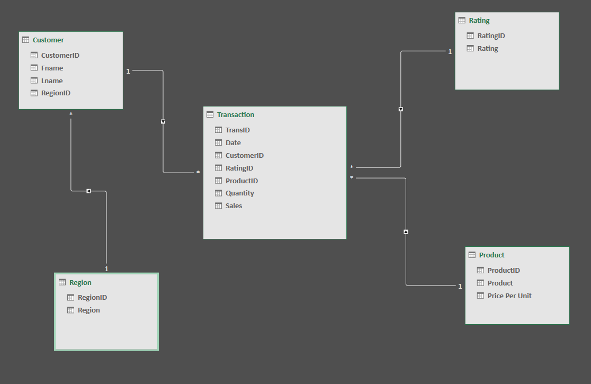

# Midterm Lab Task 1

# Data Cleaning Progress
- Step One: Autofit Columns and Rows
- Step Two: Identify and Remove duplicates
- Step Three: Trim Extra spaces 
- Step Four: Eliminate Blank Cells
- Step Five: Spell Check
- Step Six: Data Validation
- Step Seven: Handle Errors with IFERROR
- Step Eight: Check Number Formats
- Step Nine: Find & Replace
- Step Ten: Create necessary IDs and Normalize the data

  ## File link:
[File Link:] (https://github.com/TardyKoala1106/EDM_Midterms/blob/main/ways_to_clean_dataRaw(Andrei).xlsx) 

- Step Eleven: Create a Relational Data Model

  ## Sample Output:
 
