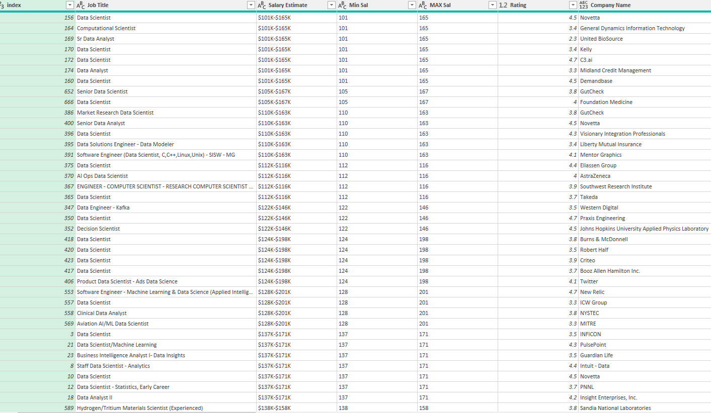
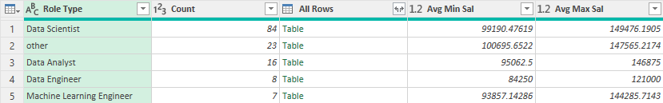
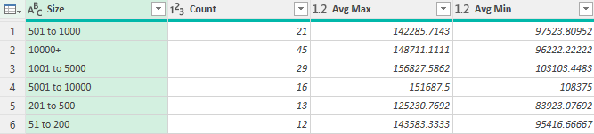
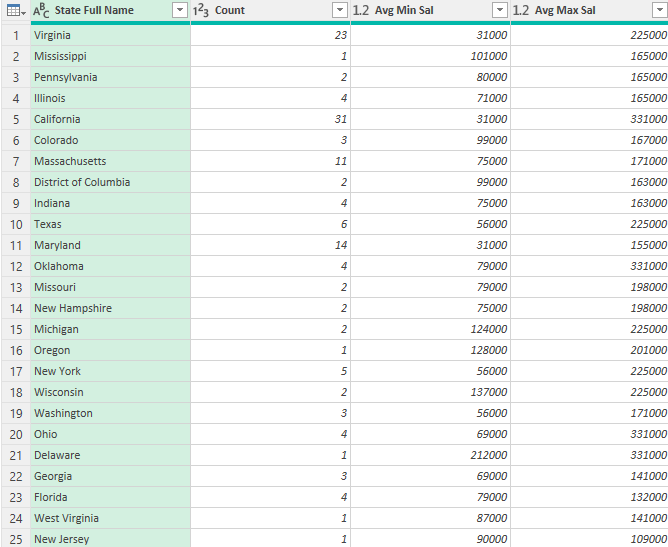
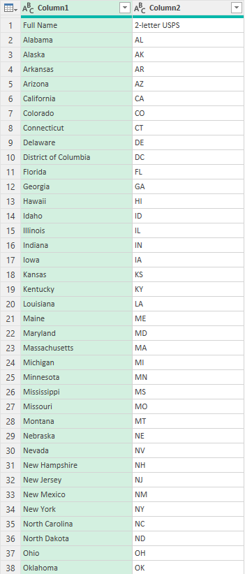

## Midterm Lab Task 2
## Data Cleaning Progress 

1. Download the Dataset
   - Download the UncleanedDSJObs.csv from the source provided.

2. Load Data in Excel
   - Open Excel. 
   - Go to the Data tab.
   - Click on Get Data → From File → From Text/CSV.
   - Select and load the UncleanedDSJObs.csv file.

3. Open Power Query Editor
   - Once the file is loaded, click on Transform Data to open the Power Query Editor.

4. Duplicate the Raw Data
   - Right-click on the query in the Queries pane (on the left) and select Duplicate. This will allow you to work on a clean version of the raw data without modifying the original.

5. Data Cleaning Tasks
   Now, follow the steps below for each specific data-cleaning task.

a. Clean the "Salary Estimate" Column
   - Go to the Transform tab.
   - In the Salary Estimate column, click the drop-down arrow.
   - Select Transform → Extract → Text Before Delimiter. 
   - In the prompt, type "(" and click OK. This will remove all text after the open parenthesis, leaving only the salary estimate.

 b. Create Min Salary and Max Salary Columns
   For Min Salary:
   - Select the Salary Estimate column.
   - Go to the Add Column tab.
   - Click Column from Examples → From Selection.
   - In the first row, type 101 (as an example of the minimum salary).
   - Press Enter, and the new column will be automatically filled with the same value.
   - Rename the new column to Min Sal by double-clicking on the column header and typing the new name.

   For Max Salary:
   - Repeat the same process for the Max Sal column by typing the appropriate maximum value in the first row (e.g., 150 or the highest value you identify from the Salary Estimate).

 c. Add Role Type Column
   - Go to the Add Column tab and click on Custom Column.
   - In the New column name box, type Role Type.
   - In the Custom column formula box, enter the following formula:

     if Text.Contains([Job Title], "Data Scientist") then "Data Scientist"
     else if Text.Contains([Job Title], "Data Analyst") then "Data Analyst"
     else if Text.Contains([Job Title], "Data Engineer") then "Data Engineer"
     
   - Click OK. This will create a new column that categorizes job roles based on keywords found in the Job Title column.

6. Apply and Close
   - Once all the steps are complete, click Close & Load to load the transformed data back into Excel.
## Output:
# Clean data:

# Salary by role type:

# Salary by role size ref:

# Salary by state ref:

# States

